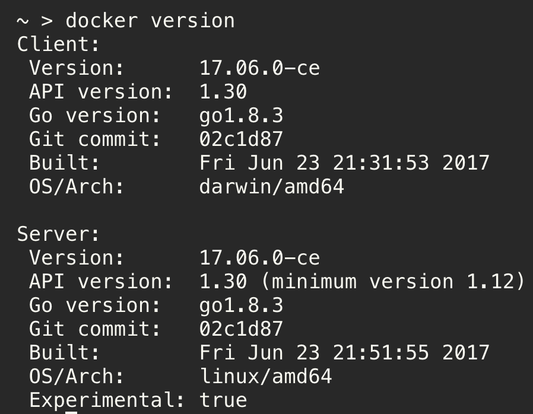
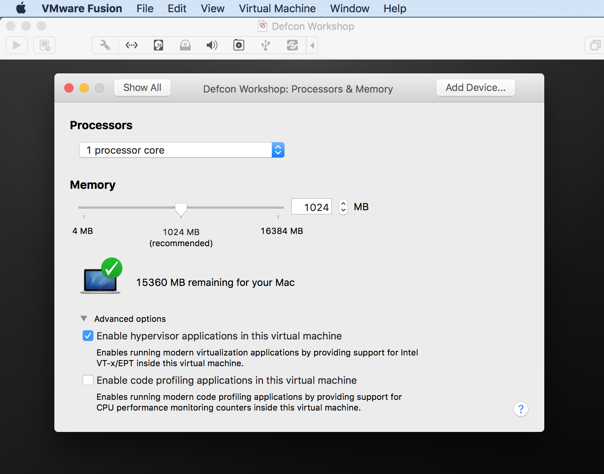

# Section-1

## Table of Contents
<!-- TOC -->

- [Section-1](#section-1)
    - [Table of Contents](#table-of-contents)
    - [Overview](#overview)
    - [Installation / Setting up](#installation--setting-up)
        - [Requirements](#requirements)
        - [Google Cloud Platform (GCP) account](#google-cloud-platform-gcp-account)
        - [MacOS](#macos)
        - [Linux - Ubuntu 16.04.2 LTS](#linux)
        - [Linux - Kali](#linux-1)
        - [Windows](#windows)
    - [Building the first Docker image](#building-the-first-docker-image)
        - [Linux/Mac](#linuxmac)
        - [Windows](#windows-1)
    - [Pushing the Docker image to Google Container Registry (GCR)](#pushing-the-docker-image-to-google-container-registry-gcr)
        - [Linux/Mac](#linuxmac-1)
        - [Windows](#windows-2)
    - [References](#references)

<!-- /TOC -->


## Overview
In this section, we will:
1. Install and set up our environment for the workshop.
2. Build our first Docker image.
3. Push our Docker image to Google Container Registry (GCR).


## Installation / Setting up
### Requirements
1. Google Cloud Platform (GCP) account
2. Docker
3. Google Cloud SDK
4. Minikube
5. kubectl
6. VirtualBox
7. Virtualenv
8. GoLang


### Google Cloud Platform (GCP) account
* You can use the GCP Free Tier to get one
    https://cloud.google.com/free/

* Go to `https://console.developers.google.com/apis` and enable `Compute Engine API`.


### MacOS

1. **Please install Homebrew if you don't already have it**

    * `/usr/bin/ruby -e "$(curl -fsSL https://raw.githubusercontent.com/Homebrew/install/master/install)"`
    * python -V should say `Python 2.7.10`

2. **Install Docker**

    * Navigate to [Docker for mac](https://docs.docker.com/docker-for-mac/install/#download-docker-for-mac) and `Get Docker for Mac (Stable)`
    * Type `docker version` and the output should look like below:



3. **Install Google Cloud SDK**

    * Navigate to [Google Cloud SDK](https://cloud.google.com/sdk/docs/quickstart-mac-os-x)
    * Download the tarball, extract it, and run ./install.sh
    * Initialize Google SDK: Open a new terminal and run `gcloud init`
    * Choose your project and the set the region to `us-west1` and zone to `us-west1-a`
    * Type `gcloud version` and this is what it should look like:

```
Google Cloud SDK 163.0.0
bq 2.0.24
core 2017.07.17
gcloud
gsutil 4.27
```

4. **Install Minikube:**

    * Type `brew cask install minikube`
    * Type `minikube version` and it should say `minikube version: v0.20.0`

5. **Install Kubectl:**

    * Install kubectl via the GCLOUD SDK - `gcloud components install kubectl`

6. **Install Virtualbox**

    * Navigate to [Virtualbox](https://www.virtualbox.org/wiki/Downloads)
    * Download for `OS X hosts` - version 5.1.24
    * Type `minikube start` and then `kubectl version`. It should look like below:


7.  **Install Virtualenv**

    * If you don't already have pip, type `sudo easy_install pip`
    * Install virtualenv by typing `sudo pip install virtualenv`

Reference: [link](https://virtualenv.pypa.io/en/stable/installation/)

8. **Install the GO programming language**

    * Install GOLANG with Homebrew by typing `brew install go --cross-compile-common`
    * go version should say `go version go1.8.3 darwin/amd64`
    * Setting your GOPATH:
        * `mkdir $HOME/go`
        * `export GOPATH=$HOME/go`
        * `open $HOME/.bash_profile` and adding `export GOPATH=$HOME/go` and `export PATH=$PATH:$GOPATH/bin`. Save the file.

Reference: [link](http://www.golangbootcamp.com/book/get_setup)


### Linux (Ubuntu 16.04.2 LTS)

Download a pre-built OVF image from [link](https://drive.google.com/drive/folders/0Bx0v3qBphpBcVXlvdDdyNFNWTkU?usp=sharing) and type `gcloud init`. Authenticate yourself. Choose your project and the set the region to `us-west1` and zone to `us-west1-a`. After importing the OVF file, shut down the VM and ensure `Enable Hypervisor applications` option is checked as shown below:



If you would rather manually go over the installation, please follow the steps below. These instructions will work on a bare metal Ubuntu 16.04.2 LTS.

1.  **Install Git**
    * `sudo apt install -y git` and then `git clone https://github.com/devsecops/defcon-workshop.git`

2.  **Install and Update**
    * `sudo apt-get update`
    * `sudo apt-get install -y linux-image-extra-$(uname -r) linux-image-extra-virtual apt-transport-https ca-certificates curl software-properties-common`
    * `curl -fsSL https://download.docker.com/linux/ubuntu/gpg | sudo apt-key add -`
    * `sudo add-apt-repository "deb [arch=amd64] https://download.docker.com/linux/ubuntu $(lsb_release -cs) stable"`
    * `sudo apt-get update`

3. **Install Docker**
    * `sudo apt-get install docker-ce`
    * `sudo groupadd docker`
    * `sudo usermod -aG docker $USER`
    * logout completely and log back in. Type `docker run hello-world`
    * `sudo systemctl enable docker`

Reference: [link](https://docs.docker.com/engine/installation/linux/docker-ce/ubuntu/)

4. **Install Google Cloud SDK**
    * `export CLOUD_SDK_REPO="cloud-sdk-$(lsb_release -c -s)"`
    * `echo "deb http://packages.cloud.google.com/apt $CLOUD_SDK_REPO main" | sudo tee -a /etc/apt/sources.list.d/google-cloud-sdk.list`
    * `curl https://packages.cloud.google.com/apt/doc/apt-key.gpg | sudo apt-key add -`
    * `sudo apt-get update && sudo apt-get install google-cloud-sdk`
    * Download `https://cloud.google.com/sdk/docs/quickstart-linux`, extract it and run `install.sh`
    * Start a new shell and type `gcloud version`. The output should look like below:


5. **Install VirtualBox**
    * Navigate to [Virtualbox](https://www.virtualbox.org/wiki/Downloads)
    * Download for `Linux hosts` - Ubuntu 16.04

6.  **Install Virtualenv**
    * `sudo apt install python-pip`
    * `sudo pip install virtualenv`

7. **Install Minikube and Kubectl**
    * `curl -Lo minikube https://storage.googleapis.com/minikube/releases/latest/minikube-linux-amd64 && chmod +x minikube && sudo mv minikube /usr/local/bin/`
    * `curl -Lo kubectl https://storage.googleapis.com/kubernetes-release/release/$(curl -s https://storage.googleapis.com/kubernetes-release/release/stable.txt)/bin/linux/amd64/kubectl && chmod +x kubectl`

    * `mkdir $HOME/.kube || true`
    * `touch $HOME/.kube/config`
    * Open .bashrc and type:
        * `export MINIKUBE_WANTUPDATENOTIFICATION=false`
        * `export MINIKUBE_WANTREPORTERRORPROMPT=false`
        * `export MINIKUBE_HOME=$HOME`
        * `export CHANGE_MINIKUBE_NONE_USER=true`
        * `export KUBECONFIG=$HOME/.kube/config`
    * `sudo -E ./minikube start --vm-driver=none --use-vendored-driver`
    * `gcloud components install kubectl`
    * `kubectl version`. It should look like below:


Reference: [link](https://github.com/kubernetes/minikube#linux-ci-installation-which-supports-running-in-a-vm-example-w-kubectl-installation)

8.  **Install GO programming language**
    * Download from `https://golang.org/doc/install?download=go1.8.3.linux-amd64.tar.gz`
    * `sudo tar -C /usr/local -xzf go1.8.3.linux-amd64.tar.gz`
    * `mkdir $HOME/go`
    * Open `$HOME/.bashrc` and type:
        * `export PATH=$PATH:/usr/local/go/bin`
        * `export GOPATH=$HOME/go`
        * `export PATH=$PATH:$GOPATH/bin`
    * Restart the shell
    * Type `go version`. It should say `go version go1.8.3 linux/amd64`

9. Type `gcloud init` and authenticate yourself. Choose your project and the set the region to `us-west1` and zone to `us-west1-a`.


### Linux (Kali)

Download a pre-built OVF image from [here](https://drive.google.com/drive/folders/0B2Q5RDVHTruOXzhyZGQtWXNGSkE?usp=sharing)  and type gcloud init. Authenticate yourself. Choose your project and the set the region to us-west1 and zone to us-west1-a. After importing the OVF file, shut down the VM and ensure Enable Hypervisor applications option is checked as shown below:

1.  **Install Google Cloud SDK**
     * https://cloud.google.com/sdk/docs/quickstart-linux

2.  **Install Docker**
     * Use this install script [kali-install-docker.sh](./scripts/kali-install-docker.sh).
     * Unfortunately, this [script] only works for x64 Kali builds.
3.  **Install Minikube**
     * https://github.com/kubernetes/minikube

4.  **Install Kubectl:**
     * Install kubectl via the GCLOUD SDK - `sudo gcloud components install kubectl`

5.  **Install Pip**
     * `sudo apt-get install python-pip`

6.  **Install Virtualenv**
     * `sudo pip install virtualenv`

7.  **Install VirtualBox**
     * `sudo apt-get install virtualbox`

8.  **Install GO programming language**
     * https://golang.org/doc/install?download=go1.8.3.linux-amd64.tar.gz

9.  **Initialize Google SDK**
     * `gcloud init`


### Windows (not supported)

1. **Install Docker Toolbox (installs virtualbox, Git, etc.)**

    https://download.docker.com/win/stable/DockerToolbox.exe

2. **Install Minikube**
    * Download this [file](https://storage.googleapis.com/minikube/releases/latest/minikube-windows-amd64.exe) and rename it to minikube.exe
    * Place it in your Program Files directory under Minikube
    * Add the folder to your PATH by right clicking on the Windows icon in the lower left hand side, clicking System, then clicking on Advanced system settings in the left hand pane
    * Click on Environment Variables at the bottom of that screen and double clicking on ‘Path’ under System variables
    * Add the following to the end: `;C:\Program Files\Minikube`
    * Now when you open a command prompt and type minikube it should run using the file in that directory

3. **Install Google SDK and KubeCtl**

    * Download and run the SDK from here: https://dl.google.com/dl/cloudsdk/channels/rapid/GoogleCloudSDKInstaller.exe
    * Uncheck all of the boxes and click finish
    * Restart your command prompt and then type: `gcloud components install kubectl`

4. **Install Virtualenv**

    https://virtualenv.pypa.io/en/stable/installation/

5. **Install the GO programming language**

    https://storage.googleapis.com/golang/go1.8.3.windows-amd64.msi

Note: If any of the tools above don’t seem like they’re working in a command prompt after installation, try closing your prompt and opening a new one.  The tool should then work.


## Building the first Docker image
* Open a shell/command prompt and clone this repository with the following command:
    * `git clone https://github.com/devsecops/defcon-workshop.git` - If this already exists, please remove it and clone it again. It is possible the codebase has changed.
*  Change into the section-1 directory of the defcon-workshop repo

### Linux/Mac
* `export PROJECT_ID=<GCP-Project-ID>`
* `docker build -t us.gcr.io/$PROJECT_ID/test:v1 .`
* `docker run --rm us.gcr.io/$PROJECT_ID/test:v1`

### Windows
* `set project_id=<GCP-Project-ID>`
* `docker build -t us.gcr.io/%project_id%/test:v1 .`
* `docker run --rm us.gcr.io/%project_id%/test:v1`


## Pushing the Docker image to Google Container Registry (GCR)

* Enable Google Container Registry API in GCP’s API Manager.
* Use `gcloud init` to make sure your gcloud configuration is for the right account and project if you run into this error: `denied: Unable to create the repository, please check that you have access to do so.`

### Linux/Mac
* `gcloud docker -- push us.gcr.io/$PROJECT_ID/test:v1`
### Windows
* `gcloud docker -- push us.gcr.io/%project_id%/test:v1`

Verify the Docker image exists by navigating to the GCP Cloud console and then `Container Registry`.

## References
- https://gist.github.com/nikallass/e5124756d0e2bdcf8981827f3ed40bcc
- https://gist.github.com/apolloclark/f0e3974601346883c731
