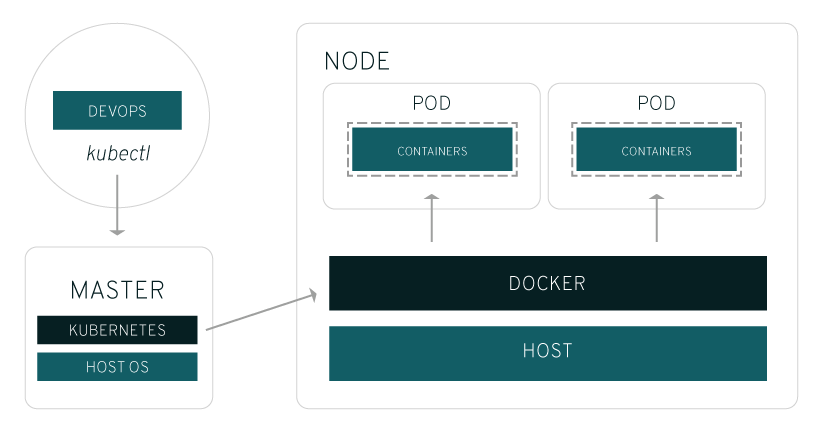

# Section-2

## Kubernetes aka K8s review

## Deploying a K8S cluster locally on minikube

* `minikube start`
* `eval $(minikube docker-env)`
* `docker ps -a` - Verify you are inside minikube's docker environment
* `kubectl apply -f local-deployment.yaml` - Deploys the local K8S cluster on Minikube
* `minikube dashboard` - Dashboard to view the deployment
* `kubectl get deployments --namespace=local-server` - Retrieve all the deployments in the namespace
* `kubectl get pods --namespace=local-server` - Retrieve all the pods in the namespace
* `kubectl scale deployment nginx-deployment --namespace=local-server --replicas 10` - Scales the deployment from 3 to 10
* `kubectl autoscale deployment nginx-deployment --namespace=local-server --min=10 --max=15 --cpu-percent=80` - Autoscale
* `kubectl delete deployments --namespace=local-server --all` - Deletes the local deployments in the namespace
* `kubectl delete namespace local-server` - Deletes the namespace

## Deploying a K8S cluster remotely on GCP

* `gcloud alpha container clusters create remote-cluster --enable-kubernetes-alpha --scopes bigquery,storage-rw,compute-ro,https://www.googleapis.com/auth/pubsub` - Creates an alpha K8S cluster with scopes
* `gcloud container clusters get-credentials remote-cluster --zone us-west1-a --project $PROJECT_ID` - Connecting to the remote K8S cluster and generating an entry in the `~/.kube/config` file for it
* `kubectl get nodes` - Verify you are talking to the remote K8S cluster
* `kubectl proxy` - Starts a proxy locally to view the remote K8S dashboard. Same as typing `minikube dashboard` in the above usecase
* `kubectl apply -f remote-deployment.yaml` - Deploys the remote K8S cluster on GCP. Similar commands as above apply here as well
* `kubectl delete deployments --namespace=remote-server --all` - Deletes the remote deployments in the namespace
* `kubectl delete namespace remote-server` - Deletes the namespace
* `gcloud alpha container clusters delete remote-cluster` - Delete the remote K8S cluster

References:
* https://kubernetes.io/docs/concepts/workloads/controllers/deployment/