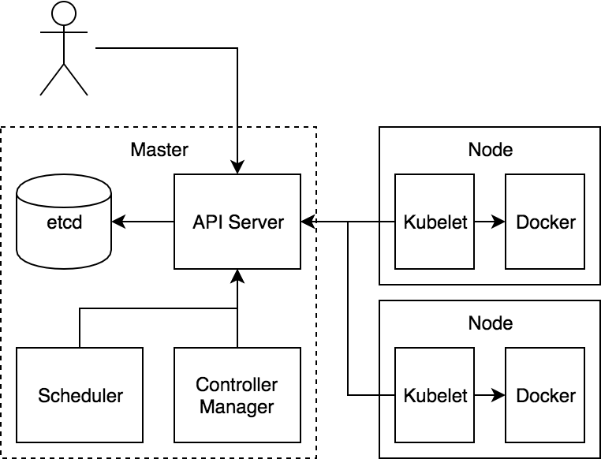

# Section-2

## Overview
In this section,
1. We will briefly discuss the various Google Cloud Platform (GCP) web services and
2. We will cover the basic concepts of [Kubernetes](https://kubernetes.io/).
3. We will deploy our first Kubernetes (K8S) cluster locally using [Minikube](https://github.com/kubernetes/minikube).
4. We will deploy our first Kubernetes (K8S) cluster remotely on GCP.

## GCP Web Services overview
* Google Compute Engine (GCE) - like AWS EC2.
* Google Container Engine (GKE) - Runs containers on a cluster. Entire backend is based on Kubernetes.
* Google BigQuery - Query large amounts of data real quick. Append only.
* Google Cloud Storage (GCS) - like AWS S3.
* Google Container Registry (GCR) - Registry/Repository to store Docker images used in a GCP account
* Google PubSub - Messaging system. Publisher/Subscription model.
    * Publish messages to a topic
    * Create a subscription to that topic
    * Listen for messages on that subscription
    * Acknowledge messages to remove from further consumption

## Kubernetes aka K8s review

### K8s Core

Reference: [link](https://blog.heptio.com/core-kubernetes-jazz-improv-over-orchestration-a7903ea92ca)

### K8s Overview

Reference: [link](https://www.redhat.com/en/containers/what-is-kubernetes)

## Deploying a K8S cluster locally on minikube

1. `minikube start`
2. `eval $(minikube docker-env)`
3. `docker ps -a` - Verify you are inside minikube's docker environment
4. `kubectl apply -f local-deployment.yaml` - Deploys the local K8S cluster on Minikube
5. `minikube dashboard` - Dashboard to view the deployment
6. `kubectl get deployments --namespace=local-server` - Retrieve all the deployments in the namespace
7. `kubectl get pods --namespace=local-server` - Retrieve all the pods in the namespace
8. `kubectl scale deployment nginx-deployment --namespace=local-server --replicas 10` - Scales the deployment from 3 to 10
9. `kubectl autoscale deployment nginx-deployment --namespace=local-server --min=10 --max=15 --cpu-percent=80` - Autoscale
10. `kubectl delete deployments --namespace=local-server --all` - Deletes the local deployments in the namespace
11. `kubectl delete namespace local-server` - Deletes the namespace

## Deploying a K8S cluster remotely on GCP

1. `gcloud alpha container clusters create remote-cluster --enable-kubernetes-alpha --scopes bigquery,storage-rw,compute-ro,https://www.googleapis.com/auth/pubsub` - Creates an alpha K8S cluster with scopes
2. `gcloud container clusters get-credentials remote-cluster --zone us-west1-a --project $PROJECT_ID` - Connecting to the remote K8S cluster and generating an entry in the `~/.kube/config` file for it
3. `kubectl get nodes` - Verify you are talking to the remote K8S cluster
4. `kubectl proxy` - Starts a proxy locally to view the remote K8S dashboard. Same as typing `minikube dashboard` in the above usecase
5. `kubectl apply -f remote-deployment.yaml` - Deploys the remote K8S cluster on GCP. Similar commands as above apply here as well
6. `kubectl delete deployments --namespace=remote-server --all` - Deletes the remote deployments in the namespace
7. `kubectl delete namespace remote-server` - Deletes the namespace
8. `gcloud alpha container clusters delete remote-cluster` - Delete the remote K8S cluster

References:
* https://kubernetes.io/docs/concepts/workloads/controllers/deployment/